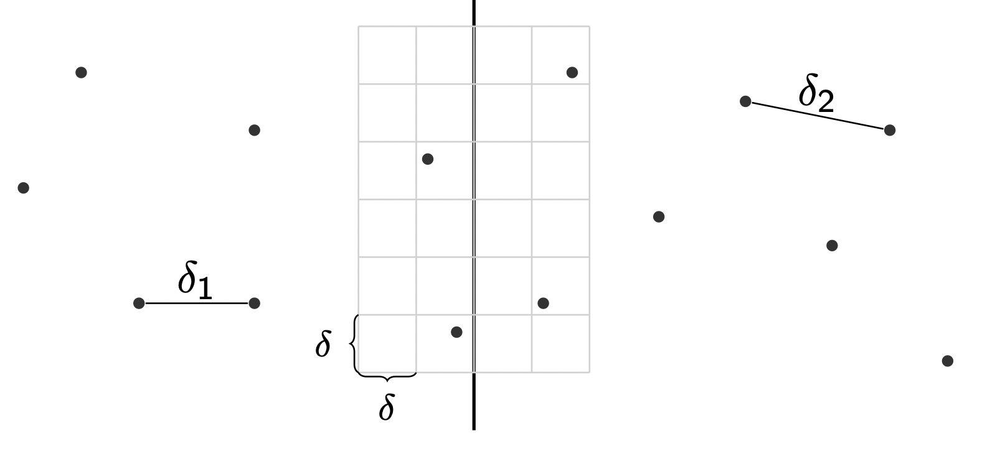

## Divide and Conquer Algorithms

**Idea :**
- Divide problem in sub-problems (most of the time 2)
- Solve subproblem recursively
- Combine patial solutions to final solution

**Typical D&C recursion complexity :**

T(n) = a T(n/b) + O(n^d)

with
- a > 0
- b > 1 
- d ≥ 0

where 
- a how often a set is divided at once (most of the time a=2)
- n/b is the maximum size of one part of the division (most of the time b=2)
- O(n^d) is the time needed for recombination (most of the time d=1)

#### Counting Inversions <hr />

**Problem :**
In an unsorted list, determine the number of pairs of elements, that are inverted, meaning a[i] > a[j] but i < j.

**Solution :**
Split the list into two of the same size. The searched number is the inversions in 
partial list a + the same for partial list b + the number of inversions between the lists. 

An optimization would be keeping the lists sorted after splitting, so inversions 
can be determined in linear time.

The latter is because for example : 1 3 8 21 | 5 10 30 35
one knows since 8 and 5 is an inversion between lists, everything in partial list a
after 8 is an inversion between lists aswell (in this case just 21 and 5). 

**Runtime Complexity :**
A runtime of O(n log n) can be achieved with the optimization

#### Closest Pair <hr />

**Problem :**
From a list of datapoints, find those with the shortest distance.

**Solution :**
Split list into two : a and b (of same size). Determine the shortest distance d 
in those recursively.
The only ones left to check are those d/2 or less away from the theoretical border 
between a and b. 

Further optimization can be achieved by sorting the points near the border by their 
y coordinate. 
That way a point has to only be compared to the nearest quadrants.
Those can at most inhabit 6 points (if their were more, d were smaller). 



**Runtime Complexity :**
Runs in O(n (log n)²).

#### Matrix Multiplication <hr />

**Problem :**
Multiply two n*n matrices.

**Solution :**
- Divide matrices A and B in 4 sub-matrices of size n/2 x n/2 as shown in the below diagram
- Calculate following values recursively. ae + bg, af + bh, ce + dg and cf + dh.
```
[a , b]   [e , f]   [a*e + b*g , a*f + b*h]
[c , d] x [g , h] = [c*e + d*g , c*f + d*h]
```
Where a, b, c, ... are of size n/2 x n/2.
The result can be calculated in **O(n³).**
Which is the same as a naive solution using three loops.
Hence it's not that interesting to me and
not yet included in the code.

#### Fast Fourier Transformation (FFT) <hr />

**Problem :**
Switch between representation of polynoms :
- by coefficients i.e. : a1*x^3 + a2*x^2 + a3*x
- by points i.e.: 

**Solution :**