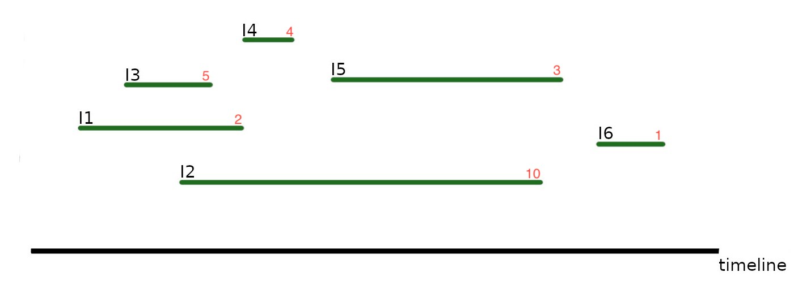
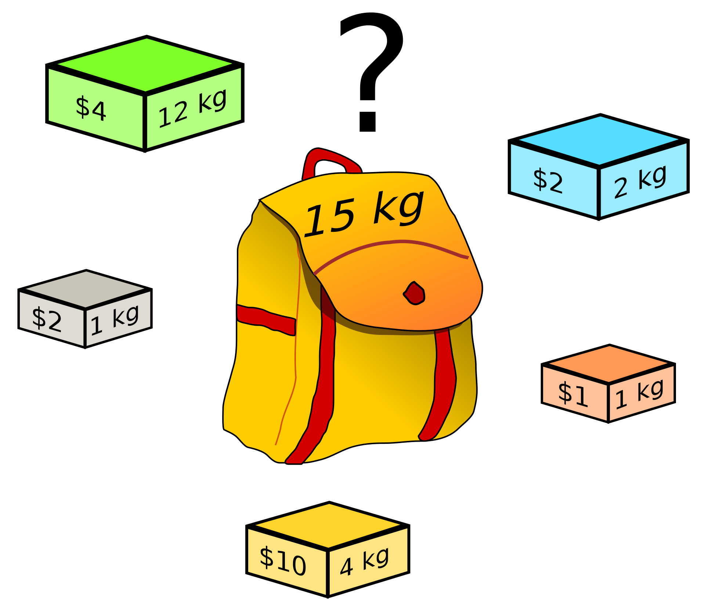

## Dynamic Programming

Creating of an efficient table that stores partial solutions.
Often implemented with bottom up recursion.

#### Weighted Interval Scheduling



**Problem :**
Interval schedueling, but with weights that are supposed to be maximized.

From the example [I3, I4, I5, I6] should be chosen for a scheduled weight of 13. Reminder : normal scheduling would be by the earliest start time and result in [I1, I4, I5, I6], which would only result in a weight of 10 though.

**Define :**
p(j) = interval i with largest endtime, that's still smaller or equal to 
the start time of j
OPT(j) = optimal solution for 1, 2 .., j

**Solution :** 
you choose the better (determined by greater value) of two options :
- taking the new value (interval) and the optimum for the one that finishes closest before
- not taking the new value (interval) and remaining with the previous optimum

**Pseudocode :**
```
1 Sort jobs by increasing endtime
2 calculate p(1), p(2) .., p(n)
3 M[0] = 0
4 for J=1 to n:
5   # the following 'max{}' implements the decision between the two 
6   # mentioned cases, which is then put in the one dimensional table M
7   M[j] = max{weight(j) + M[p(j)], M[j-1]} # M[j] = OPT(j)
```

**Runtime Complexity :**
p(j) could be calculated with a binary search O(log n) for each interval, giving that step O(n log n) which leaves the algorithm at **O(n log n).**

#### Knapsack


Source: Wikipedia, Author: Dake

**Problem :**
Objects i with weight w_i and value v_i, aswell as a maximum weight W.
Maximize the total value whilst ceeping the total weight under W.

From the example the grey, blue, orange and yellow box would be chosen, so the total weight would be 8kg < 15kg with a value of 15$.

**Define :**
OPT(i, w) = the optimum for intervalls 1, 2 .., i with a max weight of w.
OPT is now actually a table (2 dimensional).

**Solution :**
again two cases :
- taking the new value : OPT(i, w) = OPT(i-1, w-w_i) + v_i 
- keeping the old value : OPT(i, w) = OPT(i-1, w)

But in the code you wil also need to implement a continue for the loop
in case w_i is larger than the remaing w, so it can't go negative.

**Runtime Complexity :**
The runtime **O(n * W)** is proportional to the table size and is in NP !.

#### Longest Common Subsequence

Works as a similarity indicator between strings.
**Define :**
Subsequence - A is subsequence of B if A can be created by deleting elements from B

Prefix - The ith prefix of x is the the first i characters of x

**Problem :**
Find the longest char list that is a subsequence for two input strings 
A and B

**Solution :**
Go through the strings backwards :
- if both characters are the same, add it to the solution and move further on both lists
- if they are different move further on both lists but in seperate recursions and  take the better result

**Runtime Complexity :**
Again runtime is equal to table size, so **O(n * m).**


#### Shortest Paths (revisited)

**Problem :**
Again shortest path in a graph, from s to t.
This time we assume there are no negative circles (circles where edges have more negative weight than positive).

**Solution :**
Since there are no negative circles we know there is a circle free lightest path.

Bellman-Ford Algorithm:

**Define :**
OPT(i, v) = Weight of the lightest path from v to t that uses <= i edges 

cases :
- if no edges are appended OPT(i, v) = OPT(i - 1, v)
- else OPT(i,v) = min ofr all (v,w) in E{c_vw + OPT(i-1, w)}

**Pseudocode**
```
1 n = |V|
2 foreach v in V: M[0, v] = inf # M again is the table
3 M[0, t] = 0
4 for i = 1 to n - 1:
5   foreach v in V: M[i, v] = M[i - 1, v]
6   foreach(v, w) in E: M[i, y] = min{M[i,y], M[i-1, w] + c_vw} # with c_vw being the costs for that edge
```

**Runtime Complexity :**
Runs in **O(n * m)** with **O(n + m)** space.

#### Detection of negative circles

**Problem :**
Detect negtive circles in a weighted graph.

**Solution :**
OPT stays the same.

For graph with n vertices:
```
1 for v in V:
2    if OPT(n,v) != OPT(n-1,v):
3        return false
4
5 return true
```

, which is the same as running Bellman-Ford one iteratio n longer.

**Runtime Complexity :**
Hence a time complexity of **O(n * m)** is achieved.

**Real world application :**
Take a directed, weighted graph representing the trading market for currencies like euro, dollar etc. at a certain point in time, with them being nodes and being connected by edges which represent the trading of one to another, where the weight of said edge is the exchange rate.
If you found a negative circle in this graph you could just trade up your money. 