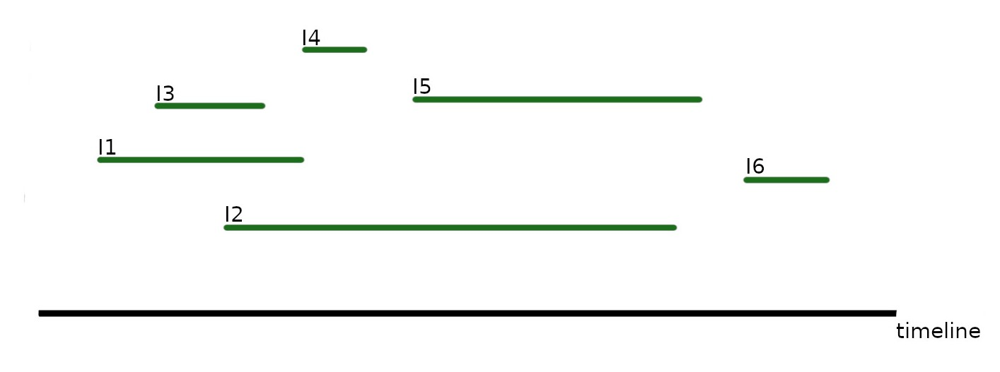
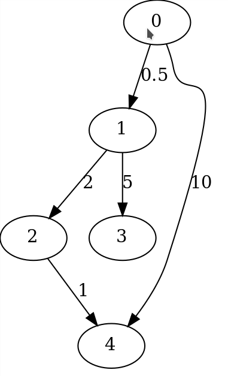

## Greedy Algorithms

### Intervals 

#### Interval Scheduling

Upfront definitions :

An interval, or job is a tuple (start, end) i.e. a job that starts at 1am and goes until 6am could be (1, 6).

Intervals a=(a-start, a-end), b=(b-start, b-end) are overlapping when b-start < a-end (or a-start < b-end). So b can not start before a has ended and vice versa.

**Problem :**
From a number of jobs with start and end time choose a subset, such that none are 
overlapping and as many are processed as possible.
From the example we would like to find [I3, I4, I5, I6].

**Solution :**
Choose the next interval to include by their endtime, earlier ones being the preference.
 
**Runtime Complexity :**
The sorting takes O(n log n). After that we only need to iterate over this sorted list, which gives us O(n) for that part and thereby O(n log n) in total.

#### Interval Partitioning

**Problem :**
Find the least number of timelines necessary such that no intervals overlap.
From the example we would like to find [I3, I4, I5, I6], [I1] and [I2].

**Solution :**
It's equal to the max number of overlapping intervals.
One could also process one after another and if they don't fit into an existing timeline, 
a new one should be created. 

**Runtime Complexity :**
The sorting takes O(n log n). After that we only need to iterate over this sorted list, which gives us O(n) for that part and thereby O(n log n) in total.

#### Interval Lateness Minimization

For this problem we will be looking at intervals of the form (duration, deadline). Therefore no overlap has to be considered.

**Problem :**
The intervals now feature a deadline. The objective is to minimize the overall time 
between deadline and end.

**Solution :**
Choose the next interval by the earliest remaining deadline.
Since we don't have to consider overlap, this is actually the whole algorithm.

**Runtime Complexity :**
O(n log n)

### Graphs 

#### Dijkstra

**Problem :**
In a directed Graph, where edges have weights/lengths, find the shortest path 
(minimizing the summed up length/weight) between two vertices s and t.

**Solution :**
Essentially BFS (Breadth First Search) is used to visit nodes layer by layer 
(so all neighbourse of the start vertex, then all neighbours of those etc.) and incrementally calculate the shortest path to each node.

Let's go through the algorithm for the example graph.
If 0 is chosen as the start and 4 is the target :
- vertex 0 is assigned distance 0, everything else infinity
- vertex 1 can clearly be reached in .5 and 4 in 10, so assign those distances for now becausethey are shorter than the assumed infinity
- vertex 0 has been processed
- as the next vertex choose the one with the shortest distance that hasn't been visited yet, which is 1, since distance .5 < 10 and every other vertex is infinitely far away
- now it's clear vertex 2 could be reached within .5 + 2 and 3 in .5 + 5
- the next chosen vertex is 2 which leads to a possible distance of 2.5 + 1 which is shorter than the previously assigned 10

so basically there are just two steps being repeated :
- choose a vertex (the one with the shortest distance, that hasn't been visited) which has now been visited
- update it's neighbors distances, if possible

**Runtime Complexity :**
O((|V| + |E|) log |V|)

#### Minimal Span Trees (MST)

**Problem :**
In an undirected graph with weighted edges, find the minimal span tree 
(a tree that contains all nodes of the original graph), with minimal 
meaning to minimize the sum of weights of used edges.

**Solution :**
Kruskal :
Choose the edge with the least weight next, whilst not creating circles

Prim :
This algorithm starts at one vertex and expands from there, with each iteration "discovering" a new one by the shortest edge we know.

Similar to Dijkstra initalize a dist value for each vertex with infinity but give one (the starting point) 0. Then until all vertices are covered :
- pick the vertex with the smallest dist value that has not been covered yet
- update adjacent vertices that can now be reached (but unlike dijkstra only take the visited edge into account !)

The resulting Code is actually amazingly close to Dijkstra

**Runtime Complexity :**
O((|V| + |E|) log |V|)

#### Huffman Codes

**Problem :**
Given some characters with each one being assigned some relative frequency or 
probability (they sum up to one), find a way to encode them (binary), 
so the length of an encoded string is minimal.

**Observation :**
Codes for characters can't be prefixes of eachother. Otherwise decoding would not be definitive.
So the objective is to find a prefix free encoding where small frequencies correlate with
short codes.

**Solution :**
Build a tree by always choosing the two elements with the smallest frequency.
These two are now assigned a parent which in turn is assigned the combined frequency (i.e. if the elements d, c with fequencies 0.1 and 0.2 are combined, their parent dc has the frequency 0.3).
For the next iteration the two elements are disregarded but their parent is taken into consideration.
Therefore over time all elements will be concatenated and the root of the tree should have a frequency of 1.
Assigning 1 and 0 to the two edges going down from each parent gives us paths of 1s and 0s to each leaf (= individual characters). Those paths are the prefix free codes.

By Alessio Damato, https://commons.wikimedia.org/w/index.php?curid=2123492

The code provided here will **not** produce this exact result because it has no clue about what path goes right and which goes left. It assigns 0 to the smaller frequency child and 1 to the other, which still yields a correct result though.
